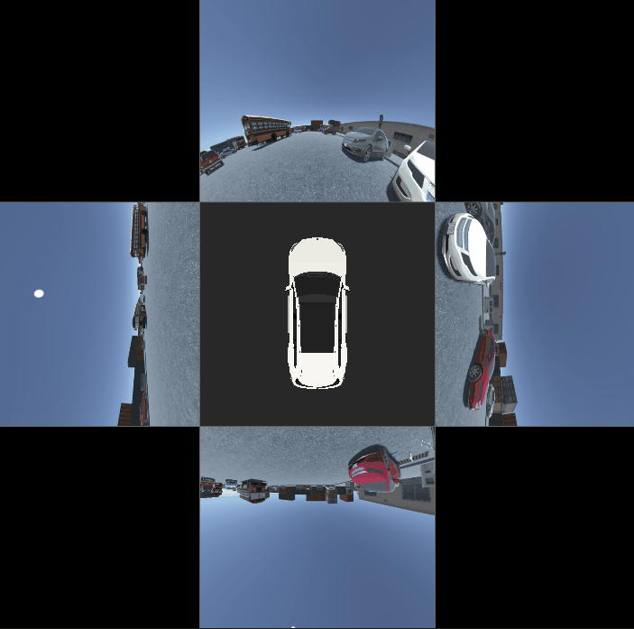

# SurroundView3D

A real-time 3D surround view system for automotive applications using OpenGL and OpenCV. This application processes multi-camera fisheye images to create a seamless bird's-eye view around a vehicle with proper calibration and undistortion.



*Real-time 3D surround view rendering with fisheye camera undistortion and car model visualization*

## Features

- **Real-time 3D Visualization**: Interactive top-down surround view with zoom controls
- **Multi-Camera Support**: Processes front, back, left, and right camera feeds simultaneously
- **Advanced Image Processing**: 
  - Fisheye lens undistortion using camera intrinsics
  - Automatic cropping to remove vehicle frame
  - Unified calibration system with YAML configuration
- **Computer Vision Cylindrical Projection**: 
  - Seamless 360° surround view with dynamic warping
  - Canvas size: 2400x1200 pixels with 360px base radius
  - Unified projection parameters (0.3f horizontal factor) across all cameras
  - Advanced angular blending with 30px blend zones for smooth transitions
  - Angular sector mapping: Front (225°-315°), Left (315°-45°), Back (45°-135°), Right (135°-225°)
  - Inner radius: 100px (car space), Outer radius: 360px (image boundary)
- **3D Car Model Rendering**: GLB model support with material colors and lighting
- **Camera Calibration**: 
  - Intrinsic parameters from `camera_intrinsics.yml`
  - Extrinsic parameters from `camera_extrinsics.csv`
- **Optimized OpenGL Pipeline**: Hardware-accelerated rendering with selective lighting
- **Multi-threaded Image Processing**: Parallel processing of camera feeds for improved performance

## Dependencies

- **OpenCV 4.x** - Image processing and camera calibration
- **OpenGL 4.5+** - 3D rendering and shader support
- **GLFW 3.x** - Window management and input handling
- **GLEW** - OpenGL extension loading
- **GLM** - Mathematics library for graphics
- **Assimp** - 3D model loading (GLB format support)

## Build Instructions

### Prerequisites
- Visual Studio 2019 or later with C++ support
- vcpkg package manager installed at `C:\vcpkg`
- CMake 3.12 or later

### Building
```bash
# Clone the repository
git clone https://github.com/maliksheharyaar/opengl-surroundview.git
cd opengl-surroundview

# Create build directory
mkdir build
cd build

# Generate build files
cmake ..

# Build the project
cmake --build . --config Release
```

### Running
```bash
cd build/Release
./SurroundView3D.exe
```

## Configuration

### Camera Calibration
- **Intrinsics**: Edit `camera_intrinsics.yml` with your camera parameters (K matrix, distortion coefficients, xi parameter)
- **Extrinsics**: Update `camera_extrinsics.csv` with camera positions and rotations relative to vehicle center

### Controls
- **Mouse Scroll**: Zoom in/out (FOV range: 10° - 150°)
- **View**: Fixed top-down perspective, camera rotated 180° for proper orientation

## Project Structure

```
├── src/                    # Source code
│   ├── main.cpp           # Application entry point
│   ├── Renderer3D.cpp     # 3D rendering engine
│   ├── ImageProcessor.cpp # Camera calibration and image processing
│   ├── Camera.cpp         # Camera controls and transformations
│   ├── Shader.cpp         # OpenGL shader management
│   ├── Mesh.cpp          # 3D mesh generation
│   └── Model.cpp         # GLB model loading
├── include/               # Header files
├── shaders/              # OpenGL shaders
│   ├── vertex.glsl       # Vertex shader
│   └── fragment.glsl     # Fragment shader with selective lighting
├── assets/               # Camera images and 3D models
│   ├── front/           # Front camera images
│   ├── back/            # Back camera images  
│   ├── left/            # Left camera images
│   ├── right/           # Right camera images
│   └── model.glb        # 3D car model
├── camera_intrinsics.yml # Camera calibration parameters
├── camera_extrinsics.csv # Camera position/rotation data
└── cmake/               # CMake configuration
```

## Technical Details

### OpenGL vs 2D Python Implementation Differences

**Important Note**: This OpenGL-based surround view implementation differs significantly from traditional 2D Python surround view projects, even though both use OpenCV:

- **Coordinate Systems**: 
  - **2D Python**: Works in image/pixel coordinates (Y-axis points down, origin at top-left)
  - **OpenGL 3D**: Uses world coordinates (Y-axis points up, origin at center, right-handed system)
  - **Stitching Approach**: Direct pixel manipulation vs 3D texture mapping on geometric planes

- **Processing Pipeline**:
  - **2D Python**: Direct image stitching using homography matrices and pixel-level blending
  - **OpenGL 3D**: 3D scene rendering with texture-mapped geometry and hardware acceleration

- **Transformation Matrices**: 
  - Matrix calculations must account for coordinate system flipping (Y-axis inversion)
  - 3D perspective projections vs 2D homography transformations

### CPU vs GPU Task Distribution

#### CPU-Based Operations (OpenCV + C++)
- **Image Loading**: File I/O and initial image decoding
- **Fisheye Undistortion**: OpenCV `remap()` operations for lens correction (parallelized per camera)
- **Image Preprocessing**: 
  - Color space conversion (BGR → RGB)
  - Image rotation (90°, 180° transformations) - parallelized
  - Cropping to remove vehicle frame
- **Layout Composition**: Stitching multiple camera views into unified surround view
- **Camera Calibration**: YAML/CSV file parsing and parameter loading
- **Memory Management**: Image buffer allocation and data transfer preparation
- **Multi-threading**: Parallel processing of multiple camera feeds using thread pool

#### GPU-Based Operations (OpenGL Shaders)
- **3D Rendering Pipeline**: Vertex and fragment shader execution
- **Texture Mapping**: Hardware-accelerated texture sampling and filtering
- **Geometric Transformations**: Matrix operations for 3D model positioning
- **Lighting Calculations**: 
  - Ambient and directional lighting for car model
  - Selective lighting (unlit rendering for surround view plane)
- **Real-time Display**: Frame buffer operations and screen rendering
- **Perspective Projection**: 3D to 2D coordinate transformation

### Image Processing Pipeline
1. **Parallel Fisheye Undistortion**: Uses camera intrinsic parameters (K matrix, distortion coefficients, xi) to correct lens distortion across all 4 cameras simultaneously
2. **Concurrent Image Preprocessing**: Simultaneous rotation and cropping operations for each camera feed
3. **Parallel Resize Operations**: Multi-threaded resizing to optimize layout composition
4. **Cylindrical Projection**: Computer vision-based seamless 360° surround view with:
   - Unified projection parameters for all cameras (0.3f horizontal factor)
   - Dynamic angular sector mapping (Front: 225°-315°, Left: 315°-45°, Back: 45°-135°, Right: 135°-225°)
   - Advanced blending with 30.0f blend zones for smooth transitions
   - Increased cylinder scaling (2400x1200 canvas, 360.0f base radius) for reduced compression
5. **Layout Composition**: Combines four camera views into a unified surround view with proper aspect ratios
6. **Texture Mapping**: Maps processed images onto a 3D plane mesh for seamless rendering

### Rendering Pipeline
- **Selective Lighting**: Car model receives full ambient and directional lighting, while surround view plane uses unlit rendering
- **Material Support**: GLB models display embedded textures and material colors
- **Zoom Controls**: Smooth FOV transitions with maintained top-down perspective
- **Aspect Ratio Preservation**: Corrected plane mesh ensures proper image proportions

### Calibration Format

**camera_intrinsics.yml**:
```yaml
front:
  K: [fx, 0, cx, 0, fy, cy, 0, 0, 1]  # Camera matrix
  D: [k1, k2, k3, k4]                  # Distortion coefficients
  xi: 0.5                              # Xi parameter
# Similar entries for back, left, right
```

**camera_extrinsics.csv**:
```csv
camera,x,y,z,roll,pitch,yaw,fx,fy,cx,cy,k1,k2,p1,p2
front,0.0,2.5,1.5,0.0,0.0,0.0,400,400,320,240,-0.2,0.1,0,0
# Positions relative to vehicle center (rear axle)
```

### Cylindrical Surround View System

The application features an advanced computer vision-based cylindrical projection system for seamless 360° surround view:

**Key Features**:
- **Unified Projections**: All cameras use identical 0.3f horizontal factor for consistent field of view
- **Angular Sector Mapping**: Cameras mapped to 90° sectors with 30px overlap zones
- **Dynamic Warping**: Real-time cylindrical coordinate transformation with bilinear interpolation
- **Advanced Blending**: 30px blend zones with smooth step functions for seamless transitions
- **High Resolution**: 2400x1200 canvas with 360px base radius for optimal quality

**Technical Implementation**:
- **Canvas Size**: 2400x1200 pixels for reduced compression
- **Base Radius**: 360px outer boundary, 100px inner boundary (car space)
- **Horizontal Mapping**: `imgX = cols * (0.5f + 0.3f * normalizedOffset)` unified for all cameras
- **Vertical Mapping**: `imgY = rows * (0.25f + 0.5f * radialFactor)` for consistent perspective
- **Angular Coverage**: 
  - Front: 225°-315° (centered at 270°/top)
  - Left: 315°-45° (centered at 0°/right side)
  - Back: 45°-135° (centered at 90°/bottom)  
  - Right: 135°-225° (centered at 180°/left side)
- **Blending Algorithm**: Radial falloff combined with angular sector blending
- **Car Model Scale**: 0.01f scaling factor for proportional representation

**Performance Characteristics**:
- **Frame Processing**: Sequential image processing (149 frames: 1851-1999.png)
- **Target Frame Rate**: 30 FPS playback of recorded sequences
- **Actual Performance**: Variable based on hardware, typically 5-15 FPS with full pipeline
- **Pipeline Complexity**: Fisheye undistortion + cylindrical projection + blending per frame
- **Memory Usage**: ~50MB for image sequences + GPU texture memory

## Performance Notes

### CPU Performance
- **Multi-threaded Processing**: Parallel undistortion and preprocessing of all 4 camera feeds
- **Thread Pool**: Automatic detection and utilization of available CPU cores
- **Cylindrical Projection**: Computer vision-based seamless surround view with unified camera projections
- **Image Processing**: Sequential processing per frame (fisheye correction → rotation → cylindrical mapping)
- **Memory Bandwidth**: Efficient CPU-GPU data transfer for texture updates
- **I/O Operations**: Sequential loading of 149 images per camera (1851-1999.png)
- **Performance Impact**: Complex pipeline reduces effective frame rate from 30 FPS target to 5-15 FPS actual

### GPU Performance  
- **Hardware Acceleration**: Parallel processing of vertices and fragments
- **Texture Memory**: Optimized texture caching and sampling
- **Shader Execution**: Simultaneous processing of multiple pixels/vertices
- **Real-time Rendering**: Interactive frame rates with complex image processing pipeline

### Architecture Benefits
- **Hybrid Processing**: CPU handles complex image algorithms with multi-threading, GPU handles rendering
- **Scalable Design**: Thread pool scales with available CPU cores for optimal performance
- **Parallel Pipeline**: Independent processing of camera feeds maximizes CPU utilization
- **Memory Efficiency**: Minimized CPU-GPU transfers through optimized texture management

## Troubleshooting

### Common Issues
- **Black car model**: Check lighting settings in fragment shader
- **Distorted images**: Verify camera intrinsic parameters in YAML file
- **Missing textures**: Ensure GLB model contains embedded materials
- **Build errors**: Check vcpkg installation and OpenCV/OpenGL dependencies
- **Coordinate system issues**: Remember Y-axis inversion between OpenCV (down) and OpenGL (up)
- **Cylindrical view gaps**: Check angular sector definitions and blending zone coverage
- **Uneven camera projections**: Ensure all cameras use unified projection parameters (0.3f factor)
- **Performance issues**: Complex pipeline (fisheye + cylindrical + blending) reduces frame rate significantly
- **Memory usage**: Large image sequences require substantial RAM for smooth playback
- **Canvas artifacts**: Verify 2400x1200 canvas size and 360px radius settings for optimal quality

### Migration from 2D Python Surround View
If adapting from a 2D Python implementation:
- **Matrix Transformations**: Invert Y-coordinates and adjust homography matrices
- **Image Coordinates**: Convert from pixel-based to normalized texture coordinates
- **Stitching Logic**: Replace direct pixel manipulation with 3D texture mapping
- **Calibration Data**: May need to adjust camera parameters for 3D coordinate system

### System Requirements
- **GPU**: OpenGL 4.5+ compatible graphics card
- **RAM**: Minimum 4GB, recommended 8GB+ for image sequence processing
- **Storage**: ~2GB for full project with image sequences (149 frames × 4 cameras)
- **CPU**: Multi-core processor recommended for parallel image processing
- **OS**: Windows 10/11 (tested), Linux support via CMake
