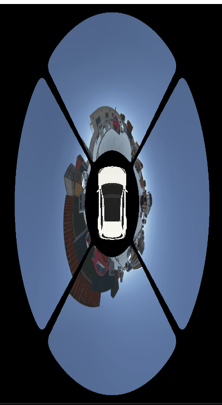

# SurroundView3D

A professional real-time 3D surround view system for automotive applications using OpenGL and OpenCV. This application processes multi-camera fisheye images to create a seamless bird's-eye view around a vehicle with advanced calibration, undistortion, and cylindrical projection algorithms.



*Real-time 3D surround view rendering with fisheye camera undistortion and car model visualization*

## Table of Contents

- [Features](#features)
- [Dependencies](#dependencies)
- [Build Instructions](#build-instructions)
- [Usage](#usage)
- [Performance Profiler](#performance-profiler)
- [Configuration](#configuration)
- [Project Structure](#project-structure)
- [Technical Documentation](#technical-documentation)
- [Performance Analysis](#performance-analysis)
- [Troubleshooting](#troubleshooting)
- [Contributing](#contributing)

## Features

### Core Functionality
- **Real-time 3D Visualization**: Interactive top-down surround view with zoom controls
- **Multi-Camera Support**: Simultaneous processing of front, back, left, and right camera feeds
- **Advanced Image Processing**: 
  - Fisheye lens undistortion using camera intrinsic parameters
  - Automatic cropping to remove vehicle frame elements
  - Unified calibration system with YAML configuration files
- **Computer Vision Cylindrical Projection**: 
  - Seamless 360° surround view with dynamic warping algorithms
  - High-resolution canvas: 2400x1200 pixels with 360px base radius
  - Unified projection parameters (0.3f horizontal factor) across all cameras
  - Advanced angular blending with 30px blend zones for smooth transitions
  - Precise angular sector mapping: Front (225°-315°), Left (315°-45°), Back (45°-135°), Right (135°-225°)
  - Optimized radius configuration: Inner radius 100px (car space), Outer radius 360px (image boundary)

### Rendering and Performance
- **3D Car Model Integration**: GLB model support with material colors and realistic lighting
- **Camera Calibration System**: 
  - Intrinsic parameters loaded from `camera_intrinsics.yml`
  - Extrinsic parameters loaded from `camera_extrinsics.csv`
- **Optimized OpenGL Pipeline**: Hardware-accelerated rendering with selective lighting algorithms
- **Multi-threaded Processing**: Parallel image processing pipeline for enhanced performance
- **Performance Profiling**: Comprehensive real-time system resource monitoring with advanced analytics

### Professional Development Tools
- **Real-time Performance Monitoring**: CPU, RAM, GPU, VRAM usage tracking with estimated FPS
- **Visual Analytics Dashboard**: Live performance charts with 100-point history and real-time data annotations
- **Benchmark Management**: CSV export/import functionality with timestamp-based naming
- **Application Control**: Integrated launch and monitoring system
- **Data Analysis**: Performance replay and visualization at 2x speed for detailed analysis

## Dependencies

### Core Libraries
- **OpenCV 4.x** - Advanced image processing and camera calibration algorithms
- **OpenGL 4.5+** - Hardware-accelerated 3D rendering and shader pipeline
- **GLFW 3.x** - Cross-platform window management and input handling
- **GLEW** - OpenGL extension loading and management
- **GLM** - Mathematics library optimized for graphics programming
- **Assimp** - 3D model loading with GLB format support and material processing

### Development Tools
- **Python 3.7+** - Performance profiler and analysis tools
- **psutil** - System and process monitoring capabilities
- **GPUtil** - NVIDIA GPU monitoring and statistics
- **matplotlib** - Real-time data visualization and charting
- **numpy** - Numerical operations for data analysis

## Build Instructions

### Prerequisites
- **Visual Studio 2019 or later** with C++ development tools
- **vcpkg package manager** installed at `C:\vcpkg`
- **CMake 3.12 or later** for build system generation
- **Git** for version control and dependency management

### Quick Build Process
```bash
# Clone the repository
git clone <your-repository-url>
cd SurroundView3D

# Create and configure build directory
mkdir build && cd build

# Generate build files with CMake
cmake ..

# Build the release version
cmake --build . --config Release
```

### Running the Application
```bash
# Navigate to the build output directory
cd build/Release

# Launch the application
./SurroundView3D.exe
```

## Usage

### Basic Operation
1. **Launch Application**: Execute `SurroundView3D.exe` from the build directory
2. **Interactive Controls**: 
   - **Mouse Scroll**: Zoom in/out (FOV range: 10° - 150°)
   - **View Mode**: Fixed top-down perspective optimized for surround view
3. **Real-time Processing**: Application automatically processes image sequences (frames 1851-1999)
4. **Performance Monitoring**: Optional profiler provides detailed system resource analysis

### Camera Data Requirements
- **Image Format**: PNG files numbered sequentially (1851.png - 1999.png)
- **Folder Structure**: Separate folders for each camera view
  - `assets/front/` - Front camera images
  - `assets/back/` - Rear camera images  
  - `assets/left/` - Left side camera images
  - `assets/right/` - Right side camera images

## Performance Profiler

### Overview
The integrated performance profiler provides comprehensive real-time monitoring of system resources and application performance metrics.

### Key Features
- **Multi-metric Monitoring**: Simultaneous tracking of CPU, RAM, GPU, VRAM usage and FPS estimation
- **Visual Analytics**: Professional dark-themed interface with live charts and real-time data annotations
- **Benchmark Management**: CSV export/import with automatic timestamp naming for performance analysis
- **Application Integration**: Direct application launch and process management from profiler interface
- **Data Replay**: Visualization of recorded performance data at 2x speed for detailed analysis

### Quick Start Guide
```bash
# Automated setup and launch (Windows)
run_profiler.bat

# Manual installation and launch
pip install -r profiler_requirements.txt
python profiler.py
```

### Profiler Workflow
1. **Launch Profiler**: Run `run_profiler.bat` or execute `python profiler.py`
2. **Start Monitoring**: Click "Launch SurroundView3D" to begin recording performance data
3. **Record Session**: Performance metrics are automatically logged during application runtime
4. **Export Data**: Use "Export CSV" to save benchmark data with timestamp
5. **Analysis**: Import previous benchmarks for comparison and replay analysis

### Performance Metrics
- **CPU Usage (%)**: Real-time system-wide processor utilization
- **RAM Usage (GB)**: Current system memory consumption including buffers
- **GPU Usage (%)**: Graphics card utilization (NVIDIA GPUs supported via GPUtil)
- **VRAM Usage (GB)**: Video memory consumption for textures and rendering buffers
- **FPS Estimation**: Approximate application frame rate (0-20 range optimized for realistic display)

### Benchmark Data Format
CSV files contain timestamped performance data:
```csv
timestamp,cpu_usage,ram_usage,gpu_usage,vram_usage,fps
0.0,45.2,4.23,12.5,1.84,8.3
0.5,52.1,4.31,15.2,1.87,7.9
...
```

## Configuration

### Camera Calibration System

#### Intrinsic Parameters (`camera_intrinsics.yml`)
Configure individual camera characteristics for accurate undistortion:

```yaml
front:
  K: [fx, 0, cx, 0, fy, cy, 0, 0, 1]  # 3x3 Camera matrix
  D: [k1, k2, k3, k4]                  # Radial distortion coefficients
  xi: 0.5                              # Omnidirectional parameter for fisheye lenses

back:
  K: [fx, 0, cx, 0, fy, cy, 0, 0, 1]
  D: [k1, k2, k3, k4]
  xi: 0.5

# Similar configuration for left and right cameras
```

#### Extrinsic Parameters (`camera_extrinsics.csv`)
Define camera positions and orientations relative to vehicle center:

```csv
camera,x,y,z,roll,pitch,yaw,fx,fy,cx,cy,k1,k2,p1,p2
front,0.0,2.5,1.5,0.0,0.0,0.0,400,400,320,240,-0.2,0.1,0,0
back,0.0,-2.5,1.5,0.0,0.0,180.0,400,400,320,240,-0.2,0.1,0,0
left,-2.5,0.0,1.5,0.0,0.0,-90.0,400,400,320,240,-0.2,0.1,0,0
right,2.5,0.0,1.5,0.0,0.0,90.0,400,400,320,240,-0.2,0.1,0,0
```

**Note**: All positions are relative to vehicle center (rear axle), with coordinates in meters and rotations in degrees.

### Application Controls
- **Mouse Scroll**: Zoom control (FOV range: 10° - 150°)
- **View Mode**: Fixed top-down perspective, camera rotated 180° for optimal orientation
- **Performance**: Target 30 FPS with complex computer vision pipeline (actual: 5-15 FPS depending on hardware)

## Project Structure

```
SurroundView3D/
├── src/                           # Core application source code
│   ├── main.cpp                  # Application entry point and main loop
│   ├── Renderer3D.cpp            # OpenGL rendering engine and 3D pipeline
│   ├── ImageProcessor.cpp        # Advanced image processing and computer vision
│   ├── Camera.cpp                # Camera controls and transformations
│   ├── Shader.cpp                # OpenGL shader management and compilation
│   ├── Mesh.cpp                  # 3D mesh generation and manipulation
│   └── Model.cpp                 # GLB model loading and material processing
├── include/                       # Header files and API definitions
│   ├── ImageProcessor.h          # Image processing pipeline interface
│   ├── Renderer3D.h              # 3D rendering system interface
│   └── [other headers]           # Additional component interfaces
├── shaders/                       # OpenGL shader programs
│   ├── vertex.glsl               # Vertex shader for 3D transformations
│   └── fragment.glsl             # Fragment shader with selective lighting
├── assets/                        # Camera images and 3D models
│   ├── front/                    # Front camera image sequence
│   ├── back/                     # Rear camera image sequence
│   ├── left/                     # Left camera image sequence
│   ├── right/                    # Right camera image sequence
│   └── model.glb                 # 3D car model with materials
├── build/                         # Build output directory
│   └── Release/                  # Release build artifacts
├── cmake/                         # CMake configuration files
├── camera_intrinsics.yml         # Camera calibration parameters
├── camera_extrinsics.csv         # Camera position and rotation data
├── profiler.py                   # Performance monitoring application
├── profiler_requirements.txt     # Python dependencies for profiler
├── run_profiler.bat             # Automated profiler setup script
└── README.md                     # This documentation file
```

## Technical Documentation

### Architecture Overview

The SurroundView3D system implements a sophisticated multi-stage pipeline combining computer vision algorithms with real-time 3D rendering:

1. **Image Acquisition**: Sequential loading of multi-camera image data
2. **Preprocessing**: Parallel fisheye undistortion and camera-specific corrections
3. **Cylindrical Projection**: Advanced warping algorithms for seamless 360° view
4. **Blending and Stitching**: Sophisticated angular blending with transition zones
5. **3D Rendering**: Hardware-accelerated OpenGL pipeline with car model integration

### Coordinate System Differences

**Important**: This OpenGL-based implementation differs significantly from traditional 2D Python surround view systems:

#### Coordinate Systems
- **2D Python Approach**: Image/pixel coordinates (Y-axis down, origin top-left)
- **OpenGL 3D Approach**: World coordinates (Y-axis up, origin center, right-handed system)
- **Processing Pipeline**: 3D texture mapping on geometric planes vs. direct pixel manipulation

#### Transformation Matrices
- **Matrix Calculations**: Account for coordinate system flipping (Y-axis inversion)
- **Projection Types**: 3D perspective projections vs. 2D homography transformations
- **Calibration Data**: May require parameter adjustment for 3D coordinate system compatibility

### Performance Architecture

#### CPU-Based Operations (OpenCV + Multi-threading)
- **Image I/O**: File loading and initial decoding with filesystem optimization
- **Fisheye Correction**: OpenCV `remap()` operations with parallel execution per camera
- **Image Preprocessing**: 
  - Color space conversion (BGR → RGB) with SIMD optimization
  - Image rotation (90°, 180° transformations) using parallel thread pool
  - Intelligent cropping to remove vehicle frame elements
- **Cylindrical Mapping**: Advanced coordinate transformation with bilinear interpolation
- **Memory Management**: Optimized buffer allocation and CPU-GPU transfer preparation

#### GPU-Based Operations (OpenGL Compute)
- **3D Rendering Pipeline**: Parallel vertex and fragment shader execution
- **Texture Operations**: Hardware-accelerated sampling, filtering, and memory management
- **Geometric Transformations**: Matrix operations for 3D model positioning and camera projection
- **Lighting Calculations**: 
  - Realistic ambient and directional lighting for car model
  - Selective lighting modes (unlit rendering for surround view plane)
- **Real-time Display**: Optimized frame buffer operations and screen rendering

### Image Processing Pipeline

#### Stage 1: Parallel Fisheye Correction
- **Input**: Raw fisheye images from 4 cameras simultaneously
- **Processing**: Camera intrinsic parameters (K matrix, distortion coefficients, xi parameter)
- **Output**: Undistorted images with preserved field of view
- **Performance**: Multi-threaded execution utilizing all available CPU cores

#### Stage 2: Cylindrical Projection System
Advanced computer vision-based seamless 360° surround view generation:

**Technical Specifications**:
- **Canvas Resolution**: 2400x1200 pixels for optimal quality vs. performance balance
- **Projection Radius**: 360px outer boundary, 100px inner boundary (car exclusion zone)
- **Horizontal Mapping**: Unified `imgX = cols * (0.5f + 0.3f * normalizedOffset)` across all cameras
- **Vertical Mapping**: Consistent `imgY = rows * (0.25f + 0.5f * radialFactor)` for perspective preservation

**Angular Coverage Mapping**:
- **Front Camera**: 225°-315° (centered at 270°/top of view)
- **Left Camera**: 315°-45° (centered at 0°/right side of view)
- **Back Camera**: 45°-135° (centered at 90°/bottom of view)
- **Right Camera**: 135°-225° (centered at 180°/left side of view)

**Advanced Blending Algorithm**:
- **Blend Zones**: 30px overlap regions between adjacent camera sectors
- **Transition Function**: Smooth step function for seamless visual integration
- **Weight Calculation**: Radial distance-based blending combined with angular sector weighting
- **Anti-aliasing**: Bilinear interpolation for smooth edge transitions

#### Stage 3: 3D Integration and Rendering
- **Texture Mapping**: Processed surround view mapped to 3D plane geometry
- **Car Model Integration**: GLB model rendering with material colors and lighting
- **Camera Controls**: Interactive zoom with FOV range 10° - 150°
- **Aspect Ratio**: Corrected plane mesh ensures proper image proportions

## Performance Analysis

### System Requirements
- **Operating System**: Windows 10/11 (primary), Linux support via CMake
- **Graphics Card**: OpenGL 4.5+ compatible GPU with 2GB+ VRAM recommended
- **Memory**: Minimum 4GB RAM, recommended 8GB+ for optimal image sequence processing
- **Storage**: ~2GB for complete project with image sequences (149 frames × 4 cameras)
- **Processor**: Multi-core CPU recommended for parallel image processing pipeline

### Expected Performance Characteristics

#### CPU Performance Metrics
- **Idle State**: 5-15% utilization (image loading and basic processing)
- **Active Processing**: 30-70% utilization (fisheye undistortion + cylindrical projection)
- **Peak Load**: 80-95% utilization (multi-camera parallel processing with full pipeline)

#### Memory Usage Patterns
- **Base Application**: ~500MB-1GB (application + image buffers)
- **Image Sequences**: +2-4GB (149 frames × 4 cameras loaded into memory)
- **Peak Usage**: 4-6GB during intensive processing with full image cache

#### GPU Performance Characteristics
- **Standard Rendering**: 20-50% utilization (OpenGL texture mapping and 3D rendering)
- **Complex Scenes**: 60-80% utilization (high-resolution textures + detailed car model)
- **VRAM Usage**: ~200-500MB (cylindrical canvas + car model textures)

#### Frame Rate Analysis
- **Design Target**: 30 FPS (optimal for smooth real-time playback)
- **Typical Performance**: 5-15 FPS (complex computer vision pipeline impact)
- **Performance Factors**: Image resolution, undistortion complexity, blending operations, hardware specifications

### Performance Optimization Features

#### Multi-threading Architecture
- **Thread Pool**: Automatic detection and utilization of available CPU cores
- **Parallel Processing**: Independent processing of all 4 camera feeds simultaneously
- **Load Balancing**: Dynamic work distribution across available threads
- **Memory Efficiency**: Optimized CPU-GPU data transfer protocols

#### Hardware Acceleration
- **GPU Pipeline**: Parallel processing of vertices and fragments in OpenGL shaders
- **Texture Memory**: Optimized caching and sampling for high-resolution textures
- **Shader Execution**: Simultaneous processing of multiple pixels/vertices per cycle

## Troubleshooting

### Common Issues and Solutions

#### Application Startup Problems
- **Black car model display**: 
  - **Cause**: Lighting configuration or shader compilation issues
  - **Solution**: Verify fragment shader settings and OpenGL context creation
- **Application crashes on startup**:
  - **Cause**: Missing OpenGL drivers or incompatible graphics hardware
  - **Solution**: Update graphics drivers to latest version, verify OpenGL 4.5+ support

#### Image Processing Issues
- **Distorted or warped images**:
  - **Cause**: Incorrect camera intrinsic parameters in YAML configuration
  - **Solution**: Verify camera calibration data in `camera_intrinsics.yml`
- **Missing or corrupted textures**:
  - **Cause**: GLB model file issues or texture loading problems
  - **Solution**: Ensure `assets/model.glb` contains embedded materials and textures

#### Build and Compilation Errors
- **CMake configuration failures**:
  - **Cause**: Missing vcpkg installation or incorrect paths
  - **Solution**: Verify vcpkg installation at `C:\vcpkg` and dependency availability
- **OpenCV/OpenGL linking errors**:
  - **Cause**: Incompatible library versions or missing dependencies
  - **Solution**: Rebuild dependencies through vcpkg, verify library compatibility

#### Performance and Quality Issues
- **Low frame rates (< 5 FPS)**:
  - **Cause**: Hardware limitations or inefficient image processing
  - **Solution**: Reduce image resolution, optimize thread pool size, close background applications
- **Cylindrical view gaps or artifacts**:
  - **Cause**: Incorrect angular sector definitions or blending parameters
  - **Solution**: Verify angular mapping ranges and blend zone coverage in projection algorithm
- **Uneven camera projections**:
  - **Cause**: Inconsistent projection parameters across cameras
  - **Solution**: Ensure all cameras use unified projection factor (0.3f) and consistent mapping

#### Profiler-Related Issues
- **GPU monitoring shows 0% usage**:
  - **Cause**: Non-NVIDIA graphics card or missing GPU drivers
  - **Solution**: Install NVIDIA GPU drivers (other metrics still function normally)
- **Permission denied errors in profiler**:
  - **Cause**: Insufficient system permissions for process monitoring
  - **Solution**: Run profiler as administrator for full system access
- **Profiler application not found**:
  - **Cause**: SurroundView3D.exe not built or incorrect path
  - **Solution**: Execute build process and verify executable in `build/Release/` directory

### Migration from 2D Python Systems

#### Code Adaptation Guidelines
- **Matrix Transformations**: Invert Y-coordinates and adjust homography matrices for OpenGL coordinate system
- **Image Coordinates**: Convert from pixel-based to normalized texture coordinates (0.0-1.0 range)
- **Stitching Logic**: Replace direct pixel manipulation with 3D texture mapping on geometric planes
- **Calibration Data**: Adjust camera parameters for 3D coordinate system compatibility

#### Performance Considerations
- **Processing Pipeline**: GPU acceleration provides significant performance improvements over CPU-only Python
- **Memory Management**: OpenGL texture memory more efficient than large Python image arrays
- **Real-time Capability**: Hardware acceleration enables real-time processing not achievable with pure Python

## Contributing

### Development Guidelines
- **Code Style**: Follow C++ best practices with clear function documentation
- **Performance**: Prioritize real-time performance in all algorithmic implementations
- **Testing**: Verify functionality across different hardware configurations
- **Documentation**: Maintain comprehensive comments for complex computer vision algorithms

### Contribution Areas
- **Algorithm Optimization**: Improve cylindrical projection and blending algorithms
- **Hardware Support**: Extend GPU compatibility beyond NVIDIA platforms
- **Calibration Tools**: Develop automated camera calibration utilities
- **Platform Support**: Enhance Linux and macOS compatibility

### Repository Information
- **Current Branch**: `feature/cylindrical-surround-view-improvements`
- **Main Repository**: Contact maintainer for contribution access
- **Issue Tracking**: Report bugs and feature requests through repository issues

---

**SurroundView3D** - Professional automotive surround view system with advanced computer vision and real-time 3D rendering capabilities.

*For technical support and additional documentation, please refer to the source code comments and profiler analysis tools.*
